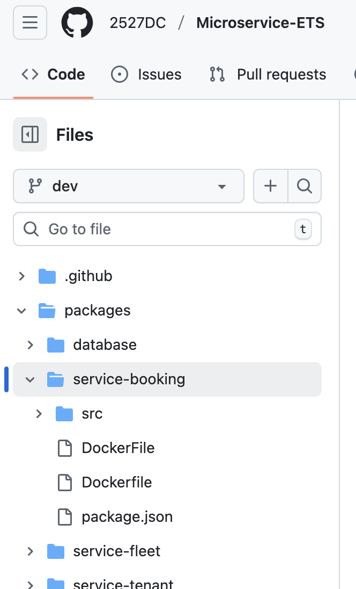

# Docker Workflow Implementation

## Workflow Overview

I implemented a GitHub Actions workflow where, upon pushing to the respective staging branch, the Docker image gets built and pushed to Docker Hub.  
The workflow also handles **multi-stage Dockerfiles**, building images for specific stages.

---

## Obstacles and Solutions

### 1. Case Sensitivity Issue with Dockerfile

The workflow initially failed due to a case mismatch between the Dockerfile in local Git (`Dockerfile`) and in GitHub (`DockerFile`).  
This occurred because `core.ignorecase` was set to `true` in my local Git.

**Solution:**

- Set `core.ignorecase` to `false` locally.
- Force-pushed to the dev branch.
- Renamed the file in GitHub to ensure the local OS treats it as a distinct file, preventing further conflicts.

---

### 2. Matrix Jobs in GitHub Actions

I learned about the **matrix strategy**, which allows jobs to run for multiple items (e.g., different services) without maintaining multiple workflow files.

**Advantage:**

- Reduces duplication of workflow files.

**Disadvantage:**

- As the number of services in the matrix increases, the logs grow larger, making the workflow file bulky and harder to navigate.

---

### 3. Built-in GitHub Actions

One important takeaway from implementing this workflow is the value of **knowing the built-in actions provided by GitHub**, as they can significantly simplify common tasks such as:

- Checking out code (`actions/checkout`)
- Setting up Docker (`docker/setup-buildx-action`)
- Logging in to Docker Hub (`docker/login-action`)
- Caching dependencies

Knowing these built-in actions can save time and make workflows more maintainable.

---

## Summary

This workflow ensures:

- Automated Docker image builds per service and stage.
- Proper handling of multi-stage Dockerfiles.
- Parallel builds using the matrix strategy.
- Robust and maintainable GitHub Actions implementation.
